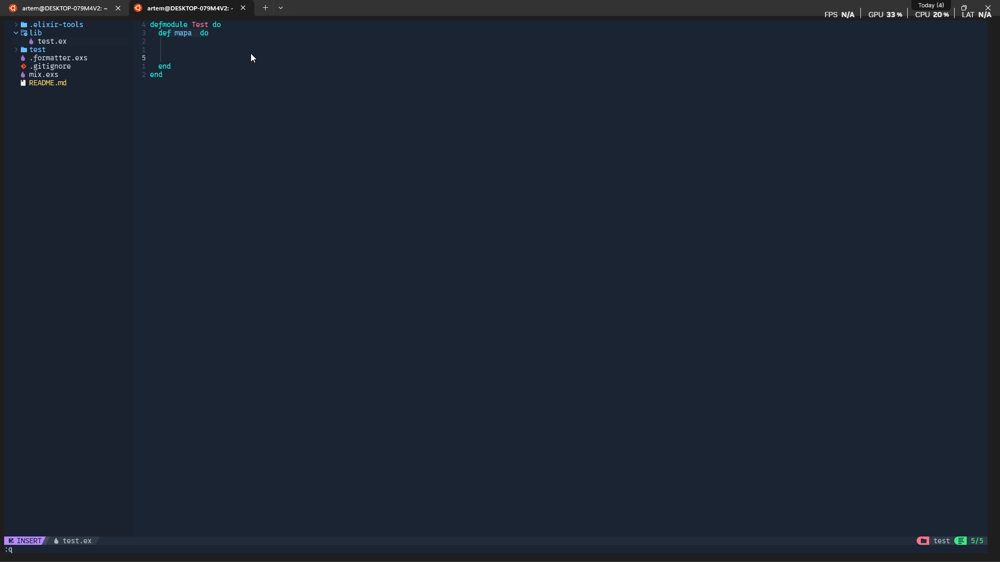

# Table of Contents

1. [Reason for Purchase](#reason-for-purchase)
2. [Choosing a Split Keyboard](#choosing-a-split-keyboard)
   1. [Why I Want Corne?](#why-i-want-corne)
   2. [Why I Ended Up Choosing Sofle Instead](#why-i-ended-up-choosing-sofle-instead)
3. [First Impressions](#first-impressions)
4. [Overview of My Config](#overview-of-my-config)
   1. [Layer 0 (Normal)](#layer-0-normal)
   2. [Layer 1 (A Powerful Text and Code Editor)](#layer-1-a-powerful-text-and-code-editor)
   3. [Layer 2](#layer-2)
5. [Sofle Settings](#sofle-settings)
   1. [Editing a ZMK Config in https://nickcoutsos.github.io/keymap-editor/](#editing-a-zmk-config-in)
   2. [Combos](#combos)
   3. [Macros](#macros)
6. [Pros, Cons, and Conclusion](#pros-cons-and-conclusion)

## Reason for Purchase

These four letters can make some people fall in love, others cry, and a few even suffer. For me — all at once 😅.

But then you get used to it… and you want more. You become a shortcut maniac. Every app action must be done with a key combo — no mouse allowed! Why? To save that extra hour a day.
My solution: moving to split keyboards (Sofle, Corne) — with a controller on the second half instead of a mouse.
Because once you taste optimization, there’s no way back.

🤔 In general, my goal was to speed up printing + speed up time for writing code + speed up interaction with the system!

")

## Choosing a split keyboard

I will be honest: I am lazy guy.
I didn’t want to order all the components, solder them, and spend evenings assembling everything. I needed a ready-to-use solution!
There are different ways to buy a split keyboard, but after some research I found out that in my city (Karaganda) it’s almost impossible to order one from the local community.

When I did the math 💸, it turned out that the best option was buying a split keyboard from AliExpress — especially if you don’t need the mouse controller. Given that I couldn’t build it myself or find someone nearby to help, this was the most practical choice.

### Why i want corne?
Corne — I wanted it because everyone who has used a split keyboard eventually switches to a smaller number of keys. You know those videos: “This weird keyboard improved my typing speed by a million percent.”

After testing it with a couple of Matyusha’s Russian words, I realized it was a mistake, simply because it turned out to have too few keys for me.
But I was “lucky” that it arrived broken — the top row of keys didn’t work. I cried and suffered for a whole month while waiting, and in the end such a nasty surprise! After hours of begging Chinese support, sending them videos + a repair report, I managed to get my hard-earned money back! Saying I was happy would be an understatement :)

⚠️ So I recommend recording a video when unboxing!
### Why I ended up choosing Sofle instead

In the end, I went with the Sofle, since it seemed like the best option on Aliexpress.

In a way, I’m grateful to fate that I chose the Sofle with a larger number of keys, because even now I still find myself running out of them — mostly when working in programs like Photoshop.

**Final build configuration:**

*Prices are listed at the time of purchase*

**Keyboard Type:**   Sofle Split Keyboard Bluetooth Dual Mode Zmk

**Link of my keyboard**: [Sofle Split Keyboard Bluetooth Dual Mode Zmk](https://aliexpress.ru/item/1005007821701661.html) **94.57$
** I checked out and my keyboard you can buy from  [67 US dollars](https://aliexpress.ru/item/1005008003069078.html?spm=a2g2w.detail.rcmdprod.0.51df4011AgZtkb&mixer_rcmd_bucket_id=aerabtestalgoRecommendAbV1_testRankingBoostFtpOpnnMedium&pdp_trigger_item_id=0_1005007821701661&ru_algo_pv_id=4c48d1-ea9d81-3d4a08-a13c41-1754967600&scenario=aerSimilarItemByContentRcmd&sku_id=12000043225531366&traffic_source=recommendation&type_rcmd=core)

**Switches**:  [Outemu Silent Peach V2 Switch Upgrade Lemon V2 Switch for Mechanical Keyboard Linear Tactile 5 Pins Lubed Switch Hot swappab](https://aliexpress.ru/item/1005006372826773.html?spm=a2g2w.orderdetail.0.0.35054aa6J5YiZe&sku_id=12000036937043389) **21.65$**

**Keycaps**: plain black keycaps $15.94

**Total cost**: $132.16

Yes, maybe it was expensive, but I don’t regret the purchase at all :) Now coding or editing text with such a keyboard is much more convenient!

## First impressions

Impressions are similar to using **nvim** in the first days — terribly unusual, my fingers even hurt. But with each passing day, I miss the keys less and less. And I have the same feeling that this keyboard really can improve my life, make it faster :)

After a month of working with this keyboard and practicing, my speed on *monkeytype.com* in the default mode without punctuation has increased from *20wpm* to *60wpm*.

Considering that I dedicated only *30 minutes* to practice.

In the end, now I can push around 89 wpm if I really try!

I’d also like to point out separately that with a split keyboard, the chances of having fewer back problems increase — since you’re not keeping your arms/shoulders in a bent position.

You might even get a + to charisma because you’ll be making jokes about a programmer’s wheelchair 😹.

Later on, I customized it for my own needs 😈! Did everything to optimize my workflow!
## Overview of my config

I think my config will suit any coder! Over a year of use, it has evolved into something pretty cool :)
### Layer 0 (normal)

The very first thing I did was assign a separate key for language switching *(on Windows, this can only be done through scripts)*.

А так же вынес на левую половинку переход на второй слой где хранятся все системные клавиши такие как F1 и PrintScreen.

### Layer 1 (A powerful text and code editor)

All the top-row keys I set up as if I were holding down SHIFT when switching to **Layer 1**.

Where there used to be numbers, they turn into special symbols. First of all, this doesn’t overload the brain during the initial adaptation. In most default configs, the **Layer 1** top row is assigned to system keys (F1, F2).

To me, that turned out to be completely inconvenient — when I tried it that way, I was missing keys and it just wasn’t comfortable. I had to constantly think about where certain keys were located.

The second block of keys is very adaptive and convenient — I put programming special characters there, the ones I use in about 85% of cases. Conveniently, I placed them closer to the middle, so I don’t have to stretch for them every time.

I also have macros on **Layer 1** that let me instantly type out special symbols. Examples: *-> => |>*.

Before moving on to the third block, I want to mention how I set up comfortable text navigation.

With **Layer 1** held down, I can move forward by words and jump to the end, just like in **vim**. This makes it really convenient to navigate through code.

Before moving on to the third block, I’d like to show how I set up comfortable text navigation.

With **Layer 1** held down, I can move forward by words and to the end, just like in **vim**. This makes navigating code very convenient.

I also mapped **home** and **end** here, which allow me to jump to the beginning or end of a line.

On the right half I placed all the vim-like movements))

For convenience, I put the most frequently used special characters here. To write something like `Me_to_write_like_this` I don’t need to stretch my hands — it’s enough to press **Layer 1 + F**.

And on Layer 4 again I placed special symbols))) Plus a couple of fun extras.

That’s the clipboard and the context menu. I mostly use the context menu for spellchecking. Shortcut: **Layer 1 + C**.

Also, on **Layer 1**, the mouse buttons trigger a shortcut I use to focus on **TickTick**))).

### Layer 3

I don’t think there’s anything special here — I just put global shortcuts + system ones.

## Sofle Settings
My **Sofle** arrived already flashed. But the default layout seemed inconvenient to me!

1) If you ever feel like reflashing it, you can find the config on the **Aliexpress** page. I recommend checking out my modified config on [soffle](https://github.com/kalachlegends/zmk-sofle.git). As I said, it’s shaped by a year of use and works great for coders!
2) After choosing the repo, fork it. You can look for tools to edit **keymappings**. Of course, you can do it manually with code, but hopefully you’re not that crazy 😥. Personally, I used this one — https://nickcoutsos.github.io/keymap-editor/.

### Editing a ZMK config in https://nickcoutsos.github.io/keymap-editor/

3) After you log in and select the repo with your ZMK config, you’ll see a canvas where you can remap **keymappings**.

From there it’s simple — just click on the key you want and choose a **Behavior** (there aren’t that many).

⚠️ **WARNING!!! To speed up your workflow, I recommend using this option**

With it, you can quickly set up the **keymappings** you need.

**Behavior** — the main behaviors for convenient configuration:

1) *kp* (KeyPress) — a normal keypress
2) *mo* (Momentary Layer) — switch to a layer. (Layers are needed to instantly switch layouts; they’re somewhat like **SHIFT** or **CTRL**)
3) *mt* (Mod/Tap) — lets you assign two actions to the same key. For example, if you just press the letter *k*, it types `k`, but if you hold it, it becomes `A`.
4) *ms..* and so on — mouse controls.

### Combos

I personally didn’t use them, but here’s what I found in the docs:

*Combo keys are a way to combine multiple presses into different outputs. For example, you can press Q and W together to output escape.*

### Macros

I used them for prewritten text — for example, to quickly write JS functions. I think you could even make snippets for LLMs to insert instantly. (FEELS LIKE I’M SOME TECH BLOGGER WRITING A TECH ARTICLE XD) XD)))))

---

## Pros, Cons, and Conclusion

**Pros:**
- Maximum customization;
	- With custom combos, text editing and development speed can increase significantly.
- After training, typing speed should improve by ~30% (personally mine went from *50wpm* → *90wpm*+);
- Editing code became ~20% easier;
- Show-off points with friends;
- Potential for automation;

**Cons:**
- Time needed to get used to it;
- Not enough keys;
- Not great for gaming (I tried playing Dota — not the same experience);
- Long setup time to fully adapt it to your needs;

**Conclusion:**

- With its custom combos and expandability, I think this can become the best keyboard out there. The only thing I’d change is the switches — I’d replace them with laptop-style ones.
- **Sofle** is not only a file sharer but also a terminal machine, a Bluetooth connector, and a *2000x accelerator*.
