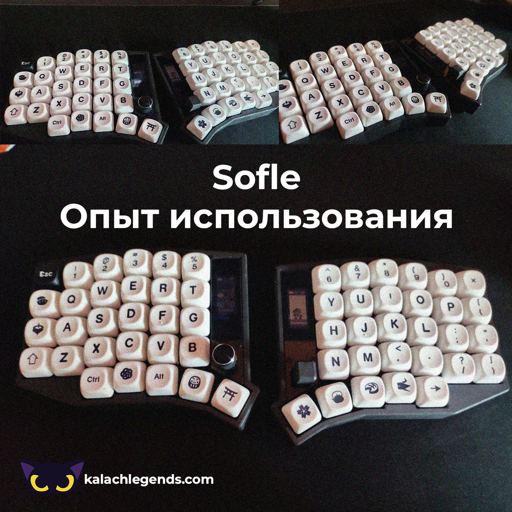
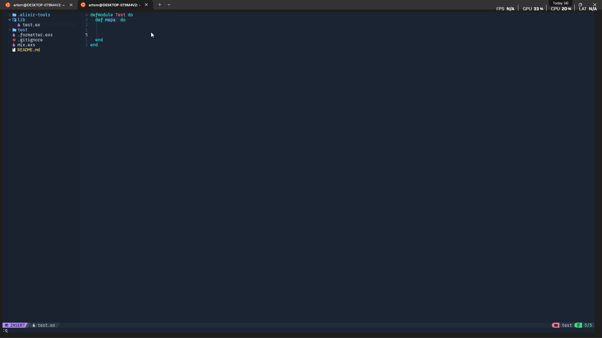

## Содержание

1. [Причина покупки](#причина-покупки)
2. [Выбор сплита](#выбор-сплита)
   - [Почему я хотел Corne](#почему-я-хотел-corne)
   - [Почему Под итог взял sofle](#почему-под-итог-взял-sofle)
3. [Первые впечатления](#первые-впечатления)
4. [Обзор моего конфига](#обзор-моего-конфига)
   - [Нулевой слой (обычный)](#нулевой-слой-обычный)
   - [Первый слой (Мощный редактор текста и кода)](#первый-слой-мощный-редактор-текста-и-кода)
   - [Третий слой](#третий-слой)
5. [Настройки sofle](#настройки-sofle)
   - [Редактирования ZMK конфига в keymap-editor](#редактирования-zmk-конфига-в-httpsnickcoutsosgithubiokeymap-editor)
   - [Combos](#combos)
   - [Macros](#macros)
1. [Плюсы минусы клавиатуры, Итоги](#плюсы-минусы-клавиатуры-итоги)

## Причина покупки

Все начиналось невинных c четырех букв *'nvim'*! Эти четыре буквы заставляют восхищаться, кого то плакать, или страдать! Меня все вместе 😢. Но потом привыкаешь и хочешь большего ты становишься маньяком шоркатов. Тебе надо чтобы каждое действие в твоих приложениях сопровождалось 10 комбинациями клавиш так к тому же без мыши! А все чтобы ты мог сэкономить часик в день! Тебе нужны ОПТИМИЗАЦИИ, везде. Моим решением стало покупка  cплита (**sofle**, **corne**) с контроллером на второй части за место мышки. 

🤔В общем у меня была цель ускорить печать + ускорить время на написание кода + ускорить взаимодействие с системой!

")

## Выбор сплита

Я очень ленивая попа мне не хотелось заказывать все комплектующие сидеть паять, собирать все. Мне нужно было готовое решение! Есть разные варианты покупки готовых сплитов. Поресерчив оказалось что в моем городе **Караганда** будет проблематично заказать готовый сплит от СНГшного народа.

Тем более в перещете на *"денюжки"* оказалось выгодным решением выбрать клавиатуру с **Aliexpress'a**  особенно если рассматривать вариант без контроллера для мыши. Учитывая что я не могу сам собрать или найти человека из СНГ который это сделает.

### Почему я хотел Corne
**Сorne** я хотел и за того что все кто пользовался сплитом однажды переходят на меньшее количество клавиш). Те самые видео 'Это странная клавиатура улучшила мою скорость печати на миллион'. 

Протестировав его на пару Матюшиных русских слов **я понял** это было ошибкой, а все потому что оказалось для меня слишком маловато клавиш. 
 Но мне повезло что он приехал сломанный , у меня не работал верхний ряд клавиш. Я плакал и страдал целый месяц ждал, а в итоге такая подлянка! После часовых угоров китайской поддержки и отправки видео + акт выполненных работ с ремонта. У меня получилось  вернуть мои кровные! То что я был рад  это нечего не сказать) 

⚠️**Так что советую снимать видео при распаковке)**
### Почему Под итог взял sofle

Под итог я взял себе **sofle** так как мне показалось что это самый наилучший вариант на **Aliexpress'e**.   

В каком то плане я благодарен судьбе что выбрал **sofle** с более большим количеством клавиш так как во время использования мне до сих пор их не хватает в основном в всяких программах типа *фотожопы* 

**Итоговая сборка такая:**

*Цены написаны на момент покупки*

**Тип клавиатуры:**   Sofle Split Keyboard Bluetooth Dual Mode Zmk

**Сссылка на мою версию**: [Sofle Split Keyboard Bluetooth Dual Mode Zmk](https://aliexpress.ru/item/1005007821701661.html) **94.57$** Чекнул цены на клавы сейчас можно взять за [67 долларов](https://aliexpress.ru/item/1005008003069078.html?spm=a2g2w.detail.rcmdprod.0.51df4011AgZtkb&mixer_rcmd_bucket_id=aerabtestalgoRecommendAbV1_testRankingBoostFtpOpnnMedium&pdp_trigger_item_id=0_1005007821701661&ru_algo_pv_id=4c48d1-ea9d81-3d4a08-a13c41-1754967600&scenario=aerSimilarItemByContentRcmd&sku_id=12000043225531366&traffic_source=recommendation&type_rcmd=core)

**Свитчи**:  [Outemu Silent Peach V2 Switch Upgrade Lemon V2 Switch for Mechanical Keyboard Linear Tactile 5 Pins Lubed Switch Hot swappab](https://aliexpress.ru/item/1005006372826773.html?spm=a2g2w.orderdetail.0.0.35054aa6J5YiZe&sku_id=12000036937043389) **21.65$**

**Кейкапы**: Кейкапы черные обынчые 15.94$

**Итого мне обошлось все в**: 132.16$

Да возможно дорого но я о покупке вообще не жалею) Сейчас кодить с такой клавиатурой или редактировать текст намного  удобнее!

## Первые впечатления

Впечатления такие - такие же как от **nvim'a** в первые дни, да жути не привычно даже пальцы болят. Но с каждым днем все чаще и чаще получается не мазать по клаве. И есть такое же предчувствие что эта клавиатура правда может улучшить мою жизнь, ускорить ее))

После месяца работы за этой клавиатурой и тренировок скорость на *monkeytype.com* на обычных настройках без знаков препинания увеличивается с *20wpm* до *60wpm*.

При том что тренировкам я уделял *30 мин*.  

Под итог сейчас могу выжать около 89 wpm если постараться!

Хотел бы отдельно отметить с использованием сплита увеличатся шанс то что у тебя будет меньше проблем со спиной. За счёт того что ты свои руки/плечи не держишь в согнутом состоянии.

Возможно у тебя будет + к харизме за счет того что ты будешь шутить шутки про инвалидное кресло для программиста 😹.

В последующем я настраивал ее для своих нужд 😈! Сделал все чтобы оптимизировать свой вокрфлоу!

## Обзор моего конфига

Я думаю мой конфиг подойдет всем кодерам! С годом использования он эволюционировал в что то прикольное)

### Нулевой слой (обычный)

Первым делом я сделал переключение языка отдельной клавишей *(для Windows такое только через скрипты можно сделать*).

А так же вынес на левую половинку переход на второй слой где хранятся все системные клавиши такие как F1 и PrintScreen.

### Первый слой (Мощный редактор текста и кода)

Все верхние клавиши  я сделал так как буд-то если зажимаю клавиши SHIFT когда я перехожу на **Слой 1**

Где раньше были цифры превращаются в спец символы. Это во первых не нагружает мозг при первых адаптациях. В обычных конфигах на **Слой 1** на верхний ряд устанавливают системные клавиши (F1, F2).

 Мне показалось это не удобным от слова вообще когда я так сделал мне не хватало клавиш и не было удобно. Надо лишний раз думать где находиться те или иные клавиши.

Второй блок клавиш очень адаптивный и удобный я вынес туда спецсимволы для программирования. Которые используется в 85% процентов случаев. Что удобно я сделал это поближе к середине что позволяет каждый раз не тянуться за этими клавишами.

Так же на **1'вом слое** у меня есть макрос которые позволяют сразу написать спец символы. Примеры спецсимволов: *-> => |>*

Перед тем как перейдем к третьему блоку хотел бы рассказать как я сделал удобное перемещение между текстом.

С нажатым **первым слоем** я могу перемещаться вперед по словам и конец словно как это было **vim**'e. Это позволяет очень удобно ориентироваться в коде

Так же тут вынесены home, end. Они позволяют перемещатся в вперёд или конец строки

На правой половинке вынесены все вимовские перемещения))

Для удобства я вынес самые переиспользуемые спец символы. `Мне_чтобы_так_написать` не надо  куда то тянуться достаточно нажать ПЕРВЫЙ СЛОЙ + F.

Ну и на четвертом опять спецсимволы))) Ну и пару приколюшек

Это буфер обмена и контекстное меню. Контекстное меню в основном использую чтобы править орфографию. ПЕРВЫМ СЛОЙ + С.

А так же **первом слое** на контроллеры на мыши при нажатии у меня находиться комбинация клавиш для фокусировки в **TickTick**))).
### Третий слой

Я считаю ничего интересного просто вынес глобальные шорткаты + системные).

## Настройки sofle
Моя **sofle** пришла мне уже прошитая. Но дефолтная раскладка лично для меня показалась не удобная!

1) Если вам приспичит ее перепрошить то конфиг можно найти на странице **Aliexpress'a**.  Советуй посмотреть мой переделанный конфиг на [soffle](https://github.com/kalachlegends/zmk-sofle.git). Как я и говорил он сформирован годом использования и классно подходит для кодеров!
2) После выбора репы сфоркайте ее . Вы можете поискать инструменты для редактирования **keymapping**'ов. Можно конечно в ручную это делать с помощью кода но вы надеюсь не такой безумец 😥. Лично я пользовался таким - https://nickcoutsos.github.io/keymap-editor/ .

### Редактирования ZMK конфига в https://nickcoutsos.github.io/keymap-editor/

3) После того как вы авторизовались и выбрали репу с ZMK конфигом. Вам откроется полотно где вы можете перенастроить **keymapping**'иги.

А дальше нечего сложно кликаете на понравившееся место и выбирать **Behavior** (там их не много).

⚠️**ВНИМАНИЕ!!! Для ускорения работы советую использовать данную опцию**

С помощью ни ее вы сможете быстро накликать нужные вам **keymapping**'иги.

**Behavior** основные behavior для удобной настройки -

1) *kp*(KeyPress) - нажатие клавиши обычной
2) *mo* (Momentary Layer) - переключиться на слой. (Слои нужны чтобы моментально менять пред настроению раскладку они чем то похожи на клавиши **SHIFT**, **CTRL**)
3) *mt* (Mod/Tap) - Можно указать два действия на одну и ту же клавиши. Условно есть вы просто нажимаете на БУКВУ *k*  она напишется если зажмете она уже будет A.
4) *ms..*   и так далее - Управление мыши.

**Combos**:

Я лично не пользовался но вот что нашел в доке:

*Комбинированные клавиши - это способ комбинировать несколько нажатий для вывода разных клавиш. Например, вы можете нажать клавиши Q и W на клавиатуре, чтобы вывести escape.*

**Macros**:

Я пользовался ими для заготовленного текста условно чтобы быстрее писать функции js. Я думаю можно сделать снипиты для нейронок чтобы вставлять просто. ПРИВЫТ ДУМАЮ ЧТО ТЫ ТЕХ БЛОГЕР НАПИШИ ТЕХ СТАТЬЮ XD)XD)))))

## Плюсы минусы клавиатуры, Итоги

**Плюсы:**
- Максимальная кастомизация;
	- За счет кастомных комбинаций скорость разработки редактуры текста может увеличиваться.;
- После обучения скорость должна увеличиться примерно на 30 процентов (У меня лично увеличилась с *50wpm* -> *90wpm*+ ) ;
- Редактировать код стало проще на 20%;
- Понты перед корешами;
- Возможная автоматизация;

**Минусы:**

- Нужно время на привыкание;
- Недостаток клавиш;
- Для игр не очень, лично пытался играть с ней в доту не тот experience;
- Долгая настройка под свои нужды ;

**Итого**: 

  
- Зачёт кастомных комбинаций и расширения считаю может стать самой лучшей клавой. Могу сказать я бы только заменил на ней свитчи условно бы сделал как на ноуте!
- **Sofle** это не только файловых обменник но еще и терминал машина, блютуз коннектор, ускоритель **2000**.
